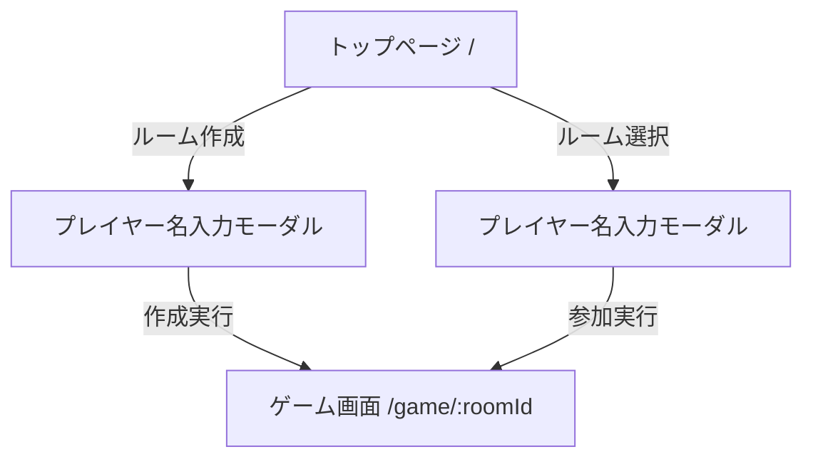

# 画面遷移設計

## 概要
本アプリケーションは、ルーム作成・参加を行う「トップページ」と、実際にプレイを行う「ゲーム画面」の2画面構成とする。

## 画面詳細

### 1. トップページ (`/`)

#### 機能・UI
- **メインビジュアル**: ゲームの雰囲気を伝えるヒーローセクション。
- **ルーム作成ボタン**: 新規にゲームルームを作成するアクション。
- **ルームリスト**: 現在参加可能な（待機中の）ルーム一覧を表示。
    - 各ルームには `参加人数 / 最大人数`、`ホスト名` などを表示。
    - 満員、またはゲーム進行中のルームは入室不可表示または非表示とする。

#### アクションフロー

**A. ルーム作成（ホスト）**
1. 「ルーム作成」ボタンを押下。
2. ダイアログ（モーダル）が表示され、**プレイヤー名**の入力を求められる。
    - （オプション）アバター画像の選択。
3. 「作成して開始」を押下。
4. `POST /api/rooms` をコールし、`roomId` と `userId` (Host) を取得。
5. 作成された `/game/[roomId]` へ遷移する。

**B. ルーム参加（ゲスト）**
1. ルームリストから参加したいルームをクリック。
2. ダイアログ（モーダル）が表示され、**プレイヤー名**の入力を求められる。
3. 「参加」を押下。
4. `POST /api/rooms/[roomId]/join` をコールし、`userId` を取得。
5. 指定された `/game/[roomId]` へ遷移する。

---

### 2. ゲーム画面 (`/game/[roomId]`)

#### 機能
ルームIDに基づいたゲーム進行画面を表示する。
URL共有による直接アクセスの場合の考慮が必要。

#### 初期化フロー
1. ページロード時、`roomId` と ローカルストレージ内の `userId` を確認。
    - `userId` がない、またはルームに参加していない場合:
        - **プレイヤー名入力モーダル** を表示し、途中参加（観戦）または新規参加フローへ誘導（仕様による）。
        - ※現状の仕様では、トップページ経由を基本とするが、直リンク時は「ゲスト参加」として名前入力を求めるのが親切。
2. `api.subscribeToRoom(roomId)` でリアルタイム通信を開始。
3. `RoomData` を取得・表示。

#### ゲーム進行
- **待機中 (WAITING)**: ホストが「ゲーム開始」を押すまで待機。
- **メイン (VOTING/RESULT)**: 投票と結果表示のサイクル。
- **終了 (FINISHED)**: 結果発表とトップへ戻るボタンを表示。

## ルーティング設定（Next.js）

- `app/page.tsx`: トップページ
- `app/game/[roomId]/page.tsx`: ゲーム画面
    - URLパラメータ `roomId` を使用して部屋を特定。
